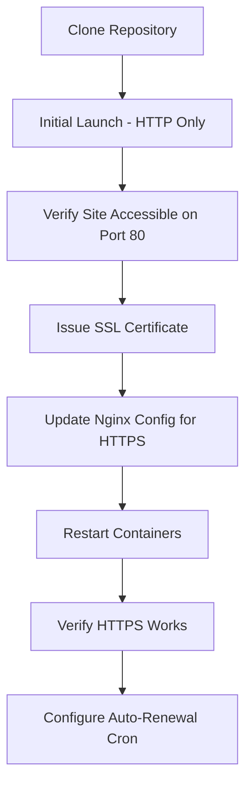
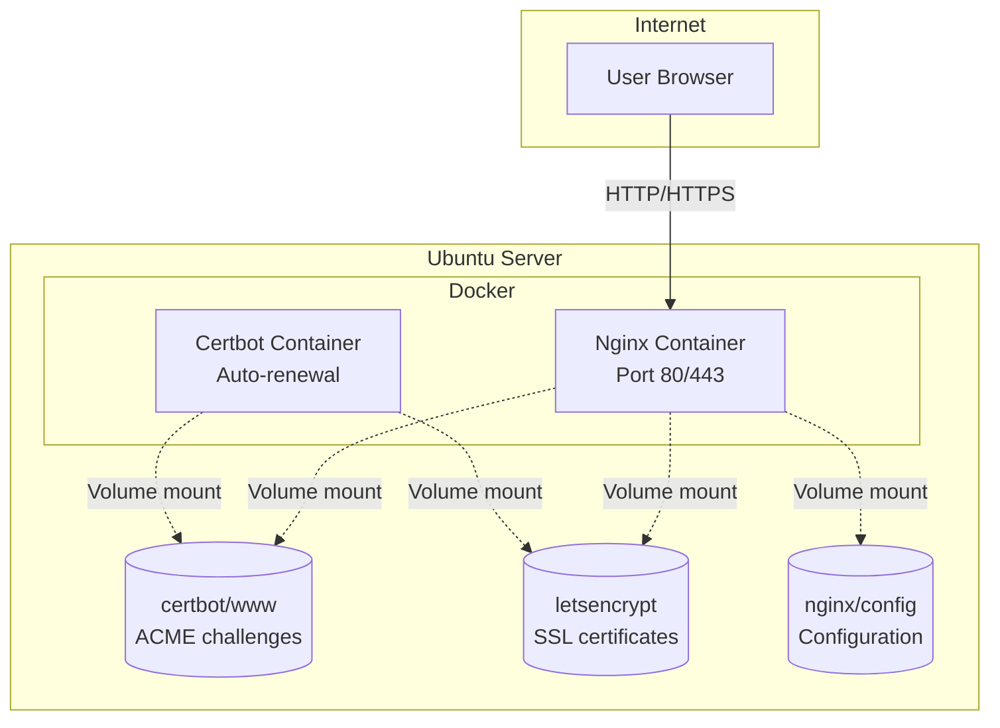

# Quickstart: Server Deployment Guide

## Overview

This document provides step-by-step instructions to deploy the Endorphina Social Media Landing Page on an Ubuntu server using Docker.

| Item | Value |
|------|-------|
| Target OS | Ubuntu 22.04 / 24.04 LTS |
| Container Runtime | Docker with Docker Compose |
| Web Server | Nginx (Alpine) |
| SSL | Let's Encrypt via Certbot |
| Ports Required | 80 (HTTP), 443 (HTTPS) |

---

## Prerequisites

### Server Requirements

| Requirement | Minimum |
|-------------|---------|
| RAM | 1 GB |
| Disk | 10 GB |
| CPU | 1 vCPU |

### Required Software

- Git
- Docker Engine
- Docker Compose (v2)

### DNS Configuration

Before deployment, configure DNS:

| Record Type | Name | Value | TTL |
|-------------|------|-------|-----|
| A | @ or subdomain | Server public IP | 300 |

---

## Deployment Workflow

---

## Step 1: Server Preparation

### 1.1 Update System

Connect to server via SSH and run system updates.

### 1.2 Install Docker

Install Docker Engine and Docker Compose plugin from the official Docker repository.

### 1.3 Configure Firewall

Open required ports in the firewall:

| Port | Protocol | Purpose |
|------|----------|---------|
| 22 | TCP | SSH access |
| 80 | TCP | HTTP / ACME challenge |
| 443 | TCP | HTTPS |

---

## Step 2: Clone and Deploy

### 2.1 Clone Repository

Clone the project to the server deployment directory:

| Setting | Value |
|---------|-------|
| Recommended path | /opt/endorphina-links |
| Repository | GitHub repository URL |

### 2.2 Navigate to Project Directory

Change to the project directory after cloning.

### 2.3 Initial Launch (HTTP Only)

Build and start containers in detached mode with the build flag.

Expected result:

| Container | Status | Purpose |
|-----------|--------|---------|
| endorphina-nginx | Running | Serves static site |
| endorphina-certbot | Running | Certificate renewal daemon |

### 2.4 Verify HTTP Access

Open the domain in a browser to confirm the site loads over HTTP (port 80).

---

## Step 3: SSL Certificate Setup

### 3.1 Request Certificate from Let's Encrypt

Run certbot in webroot mode to obtain SSL certificate.

Required parameters:

| Parameter | Description |
|-----------|-------------|
| Domain | Your actual domain name |
| Email | Contact email for expiry notifications |
| Webroot | /var/www/certbot (mapped volume) |

### 3.2 Verify Certificate Files

After successful issuance, certificate files are stored in:

| File | Path |
|------|------|
| Full chain | /etc/letsencrypt/live/DOMAIN/fullchain.pem |
| Private key | /etc/letsencrypt/live/DOMAIN/privkey.pem |

---

## Step 4: Enable HTTPS

### 4.1 Update SSL Configuration

Edit the file `nginx/default-ssl.conf`:

| Placeholder | Replace With |
|-------------|--------------|
| YOUR_DOMAIN | Actual domain name (all occurrences) |

### 4.2 Switch Nginx to SSL Config

Modify `docker-compose.yml` to mount the SSL configuration:

| Original Mount | New Mount |
|----------------|-----------|
| ./nginx/default.conf:/etc/nginx/conf.d/default.conf:ro | ./nginx/default-ssl.conf:/etc/nginx/conf.d/default.conf:ro |

### 4.3 Restart Containers

Stop and start the containers to apply the new configuration.

### 4.4 Verify HTTPS

Confirm the site loads with a valid SSL certificate (padlock icon in browser).

---

## Step 5: Configure Automatic Certificate Renewal

### 5.1 Certbot Auto-Renewal

The certbot container automatically checks for renewal every 12 hours. No additional configuration needed for certificate renewal itself.

### 5.2 Nginx Reload Cron Job

Add a daily cron job on the host to reload Nginx after certificate renewal:

| Schedule | Time | Purpose |
|----------|------|---------|
| Daily | 03:00 | Reload Nginx to pick up renewed certificates |

---

## Maintenance Operations

### Update Site Content

After modifying links, styles, or components:

| Action | Description |
|--------|-------------|
| Rebuild | Rebuild containers with updated content |
| Downtime | Near-zero (old container serves until new one is ready) |

### View Container Logs

| Container | Log Purpose |
|-----------|-------------|
| nginx | Access logs, error logs |
| certbot | Renewal status, errors |

### Manual Certificate Renewal

If automatic renewal fails:

| Step | Action |
|------|--------|
| 1 | Run certbot renew manually |
| 2 | Reload nginx configuration |

---

## Troubleshooting

### Container Not Starting

| Symptom | Possible Cause | Solution |
|---------|----------------|----------|
| Port 80/443 in use | Another service using ports | Stop conflicting service or change ports |
| Build fails | npm install error | Check network connectivity, clear Docker cache |
| Permission denied | Docker socket permissions | Add user to docker group |

### SSL Certificate Issues

| Symptom | Possible Cause | Solution |
|---------|----------------|----------|
| Certificate not issued | DNS not propagated | Wait for DNS propagation, verify A record |
| ACME challenge fails | Port 80 blocked | Check firewall rules |
| Certificate expired | Auto-renewal not working | Run manual renewal |

### Nginx Errors

| Symptom | Possible Cause | Solution |
|---------|----------------|----------|
| 502 Bad Gateway | Backend not reachable | Not applicable (static site) |
| 403 Forbidden | Permission on files | Check file permissions in container |
| Config test fails | Syntax error in config | Validate nginx configuration |

---

## Security Recommendations

| Recommendation | Priority |
|----------------|----------|
| Enable HSTS header after confirming HTTPS works | High |
| Keep Docker and host OS updated | High |
| Use SSH keys, disable password auth | High |
| Configure fail2ban for SSH protection | Medium |
| Regular backups of letsencrypt directory | Medium |

---

## File Checklist for GitHub Transfer

| File/Directory | Status | Notes |
|----------------|--------|-------|
| Dockerfile | Ready | Multi-stage build configured |
| docker-compose.yml | Ready | Services defined correctly |
| nginx/default.conf | Ready | HTTP-only for initial launch |
| nginx/default-ssl.conf | Requires edit | Replace YOUR_DOMAIN before use |
| .dockerignore | Ready | Excludes unnecessary files |
| .gitignore | Ready | Excludes node_modules, dist |
| certbot/www/.gitkeep | Ready | Placeholder for ACME webroot |
| letsencrypt/.gitkeep | Ready | Placeholder for certificates |
| README.md | Ready | Documentation complete |

---

## Architecture Summary

