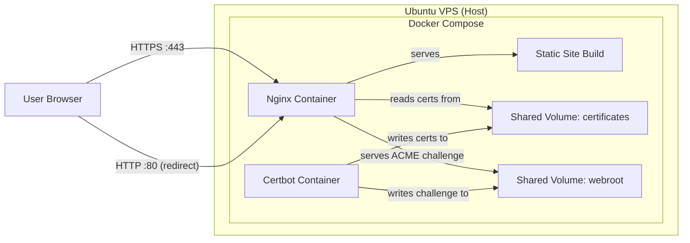

# One-Page Link Hub — Endorphina Social Media Landing

## 1. Overview

A self-hosted, single-page link-in-bio landing (Linktree alternative) for Endorphina's social media presence. The page serves as a centralized brand hub linking to official social channels, designed with a dark premium aesthetic and deployed entirely via Docker on a VPS.

This is a **greenfield project** — no backward compatibility with any prior architecture is required.

### Scope Boundaries

| Included | Excluded |
|---|---|
| One-page landing with 5 social media cards | CMS / admin panel |
| Responsive layout (PC + mobile) | Analytics (GA4, Matomo, pixels) |
| Dark premium design with glow/neon accents | Data collection / forms / database |
| JSON-driven link configuration | Multilingual support |
| Docker-first deployment (Nginx + Certbot) | SEO optimization for search promotion |
| HTTPS via Let's Encrypt with auto-renewal | UTM generation on the website side |
| README with full operational instructions | User accounts / backend |

## 2. Page Structure and Content

The page consists of three vertical sections rendered top-to-bottom:

### 2.1 Logo Block (Top)

- Displays the Endorphina logo image
- Centered horizontally
- Logo file placed at a known path (e.g., `public/assets/logo.svg`), provided by the user
- Must include alt text for accessibility

### 2.2 Social Media Card Grid (Main)

- Renders cards dynamically from a JSON config file
- Card order on page matches array order in JSON
- Initial launch: 5 cards (LinkedIn, Instagram, Facebook, X, YouTube)
- Architecture supports 6–10+ cards without structural changes

**Per-card content:**

| Element | Description |
|---|---|
| Icon | SVG icon for the social platform, path from JSON |
| Title | Platform name (e.g., "LinkedIn") |
| Clickable area | Entire card is a single link element |
| URL | Destination from JSON, opened with `target="_blank"` and `rel="noopener noreferrer"` |

### 2.3 Footer Contact Block (Bottom)

- Displays a single email address link
- Email address value should be easily configurable (stored alongside or within the JSON config, or as a simple constant in the layout)
- Minimal styling, consistent with overall dark theme

## 3. Visual Design

### 3.1 Style Direction

- Minimalistic, premium, dark aesthetic
- Lightweight glow/neon effects using CSS gradients and blur (no heavy libraries or background videos)
- Visually aligned with the Endorphina brand

### 3.2 Color Palette

| Role | Color | Usage |
|---|---|---|
| Main background | `#111725` | Page and card backgrounds |
| Primary text | `#FFFFFF` | Titles, labels, contact info |
| Primary accent | `#2899D5` | Hover glow, focus rings, card borders |
| Secondary accent | `#EE212E` | Alternate hover states, subtle glow highlights |
| Tertiary accent | `#FBAD18` | Sparse additional accents where needed |

### 3.3 Typography

- **Primary font:** Benzin-Bold, loaded via a local `.woff2` file (placed at `public/assets/fonts/Benzin-Bold.woff2`)
- **Fallback:** System sans-serif stack
- Font is declared via a CSS `@font-face` rule

### 3.4 Card Visual Treatment

- Cards have a subtle dark surface color distinguished from the main background
- On hover: glow effect using CSS `box-shadow` with accent color, slight scale or brightness shift
- On focus: visible focus ring (accent color) for keyboard navigation
- Smooth CSS transitions for all interactive states

## 4. Responsive Layout Strategy

### 4.1 Breakpoint Behavior

| Viewport | Card Layout | Notes |
|---|---|---|
| Mobile (< 768px) | Single-column vertical stack | Full-width cards, comfortable tap targets (min 48px touch area) |
| Tablet (768px–1024px) | 2-column grid | Balanced spacing |
| Desktop (> 1024px) | 2–3 column grid, max-width constrained | Centered on page, no horizontal scroll |

### 4.2 Layout Constraints

- Page content is horizontally centered with a max-width container
- No horizontal scrolling at any viewport
- Adequate spacing and padding scale proportionally
- Cards maintain readable proportions across breakpoints

## 5. Data Model

### 5.1 Links JSON Config

Located at `src/data/links.json`. This is the single source of truth for all social media cards.

**Schema per entry:**

| Field | Type | Required | Description |
|---|---|---|---|
| `id` | string | Yes | Unique identifier for the social platform |
| `title` | string | Yes | Display name shown on the card |
| `url` | string | Yes | Full destination URL (may include UTM params) |
| `icon` | string | Yes | Path to SVG icon relative to public root |

**Behavioral rules:**

- Array order dictates card render order on the page
- URLs are used as-is (no UTM generation or modification)
- Adding a new card requires only appending a new JSON object to the array
- No build-time validation beyond standard JSON parsing

## 6. Component Architecture

The frontend is built with Astro, generating a fully static site at build time.

### 6.1 Component Breakdown

| Component | Responsibility |
|---|---|
| **BaseLayout** | HTML document shell: meta tags, font loading, global styles, favicon reference |
| **LogoBlock** | Renders the centered Endorphina logo with alt text |
| **SocialGrid** | Reads `links.json`, iterates entries, renders a SocialCard per item in a responsive grid |
| **SocialCard** | Renders a single linked card: icon, title, full-card clickable area with safe link attributes |
| **FooterContacts** | Renders the email contact link in the page footer |

### 6.2 Page Composition

The `index.astro` page assembles components within `BaseLayout` in this order:

```
BaseLayout
  └─ LogoBlock
  └─ SocialGrid
       └─ SocialCard (repeated per JSON entry)
  └─ FooterContacts
```

### 6.3 Styling Approach

- Custom CSS only — no heavy UI frameworks (no Bootstrap, Tailwind, etc.)
- Styles organized into separate files: global resets, CSS custom properties (design tokens for colors/spacing), and component-specific styles
- Glow/neon effects achieved purely with CSS (`box-shadow`, `background: radial-gradient`, `filter: blur`)

## 7. Accessibility (Basic Level)

| Requirement | Implementation Approach |
|---|---|
| Color contrast | All text/background combinations meet WCAG AA contrast ratios |
| Hover states | Visible glow/color change on card hover |
| Focus states | Visible focus ring (accent color outline) on keyboard focus |
| Keyboard navigation | All cards are focusable and activatable via Tab + Enter |
| ARIA labels | Each card link includes `aria-label` with the platform name if the link text alone is insufficient |
| Logo alt text | Logo image includes descriptive alt attribute |

## 8. SEO and Metadata

| Element | Approach |
|---|---|
| Page title | Set to a descriptive brand title (e.g., "Endorphina — Official Links") |
| Meta description | Brief one-line description of the page purpose |
| Favicon | Included (`public/favicon.ico`), provided by user or generated |
| Open Graph | Not required (excluded from scope) |
| Web manifest | Not required |
| Cookie banner | Not required (no analytics or tracking) |

## 9. Infrastructure and Deployment

### 9.1 Architecture Overview



### 9.2 Docker Compose Services

| Service | Base Image | Role |
|---|---|---|
| **nginx** | `nginx:alpine` | Serves the static Astro build, handles HTTP→HTTPS redirect, terminates TLS |
| **certbot** | `certbot/certbot` | Issues and auto-renews Let's Encrypt certificates |

### 9.3 Build Strategy

The static site is built via a **multi-stage Dockerfile**:

- **Stage 1 (Build):** Uses a Node.js Alpine image, installs dependencies, runs the Astro build to produce static output
- **Stage 2 (Serve):** Uses the Nginx Alpine image, copies the static build output into the Nginx serving directory

### 9.4 Shared Volumes

| Volume / Mount | Purpose | Used By |
|---|---|---|
| Let's Encrypt certificates directory | Stores issued SSL certificates and keys | Nginx (read), Certbot (write) |
| ACME webroot directory | Serves `/.well-known/acme-challenge/` for domain validation | Nginx (serve), Certbot (write) |

### 9.5 Nginx Configuration

Two configuration files are provided:

| Config File | Purpose | When Used |
|---|---|---|
| **HTTP-only config** | Serves site on port 80, includes ACME challenge location | Initial launch (before first certificate issuance) |
| **HTTPS config** | Listens on 443 with TLS, redirects port 80 to HTTPS, references certificate paths from shared volume | After successful certificate issuance |

Switching from HTTP-only to HTTPS config is a manual step documented in the README.

### 9.6 SSL Certificate Lifecycle

**Initial issuance:**

1. Start Docker Compose with the HTTP-only Nginx config
2. Run certbot container to request certificate via webroot challenge
3. Switch Nginx to the HTTPS config
4. Restart/reload Nginx container

**Auto-renewal:**

- The Certbot container runs a periodic renewal process (cron-based, e.g., checking twice daily)
- After successful renewal, Nginx must reload to pick up new certificates
- This is automated via a renewal hook or a scheduled signal to the Nginx container (e.g., `docker compose exec nginx nginx -s reload` triggered post-renewal)

### 9.7 Port Requirements

| Port | Protocol | Purpose |
|---|---|---|
| 80 | HTTP | ACME challenge validation + redirect to HTTPS |
| 443 | HTTPS | All user traffic (TLS-terminated at Nginx) |

### 9.8 Host Prerequisites

- Ubuntu 22.04 or 24.04 VPS
- Minimum 1 GB RAM, 10 GB disk
- Docker and Docker Compose installed
- Domain/subdomain with DNS A record pointing to the VPS IP
- Ports 80 and 443 open in firewall

## 10. Project File Structure

```
company-social-media-landing/
├── .gitignore
├── README.md
├── docker-compose.yml
├── Dockerfile                        # Multi-stage: Astro build -> Nginx static serve
├── nginx/
│   ├── default.conf                  # HTTP-only config (initial launch / ACME)
│   └── default-ssl.conf             # HTTPS + HTTP redirect (post-SSL)
├── certbot/
│   └── www/                          # Webroot for ACME challenge (bind mount)
├── letsencrypt/                      # Certificates (bind mount / volume)
├── public/
│   ├── assets/
│   │   ├── logo.svg                  # Endorphina logo (user-provided)
│   │   ├── icons/
│   │   │   ├── linkedin.svg
│   │   │   ├── instagram.svg
│   │   │   ├── facebook.svg
│   │   │   ├── x.svg
│   │   │   └── youtube.svg
│   │   └── fonts/
│   │       └── Benzin-Bold.woff2    # Custom brand font (user-provided)
│   └── favicon.ico
├── src/
│   ├── components/
│   │   ├── SocialCard.astro
│   │   ├── SocialGrid.astro
│   │   ├── LogoBlock.astro
│   │   └── FooterContacts.astro
│   ├── data/
│   │   └── links.json                # Editable social media link config
│   ├── layouts/
│   │   └── BaseLayout.astro
│   ├── pages/
│   │   └── index.astro
│   └── styles/
│       ├── global.css                # Resets, font-face, base styles
│       ├── variables.css             # CSS custom properties (colors, spacing)
│       └── components.css            # Card grid, card, logo, footer styles
├── astro.config.mjs
├── package.json
└── tsconfig.json
```

## 11. Performance Considerations

| Concern | Mitigation |
|---|---|
| Page load speed | Astro generates fully static HTML — no client-side JS runtime needed |
| Asset weight | SVG icons (small), single .woff2 font file, no heavy images |
| Visual effects | All glow/neon effects are CSS-only (gradients, box-shadow, blur) — no JS animation libraries |
| Caching | Nginx should set appropriate cache headers for static assets (long TTL for fonts/icons, shorter for HTML) |

## 12. README Documentation Requirements

The README must include the following sections:

| Section | Content |
|---|---|
| Project description | What the page is and its purpose |
| Tech stack | Astro, CSS, Nginx, Certbot, Docker Compose |
| Local development | How to run the Astro dev server locally |
| Production build | How to build the static site |
| Docker Compose launch | How to start the full stack |
| Changing links | Path to `src/data/links.json` and instructions for editing |
| Replacing logo / icons / font | File paths and format expectations |
| Initial SSL issuance | Step-by-step Certbot first-run in Docker |
| Switching to HTTPS config | How to swap Nginx config after cert issuance |
| Certificate renewal | Explanation of auto-renewal and how to verify |
| Nginx reload after renewal | How the automated reload works, plus manual fallback command |
| Server requirements | OS, RAM, disk, open ports (80/443) |
| Domain and DNS | Note that a domain with correct A record is required |

## 13. User-Provided Assets

The following assets must be provided by the project owner and placed at the specified paths:

| Asset | Expected Path | Format |
|---|---|---|
| Endorphina logo | `public/assets/logo.svg` | SVG (preferred) or PNG |
| Benzin-Bold font | `public/assets/fonts/Benzin-Bold.woff2` | WOFF2 |
| Favicon | `public/favicon.ico` | ICO or PNG |
| Social media URLs | `src/data/links.json` | JSON (with optional UTM params pre-embedded) |
| Contact email | Configured in footer component or a config constant | Plain text email address |
