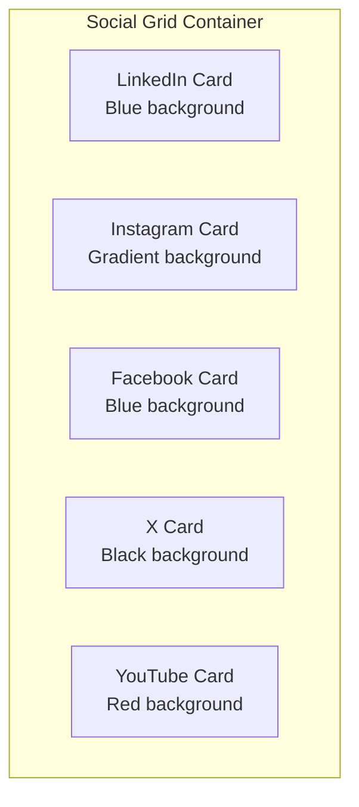
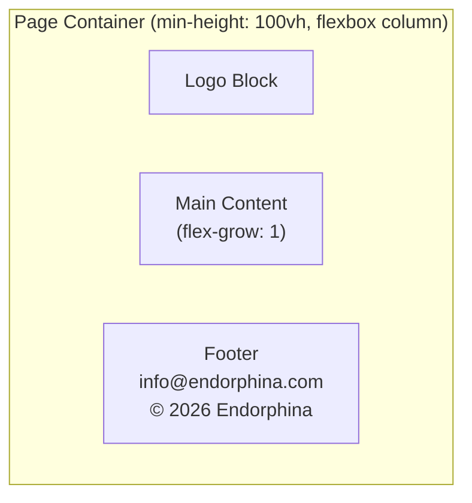

# Social Icons Layout Redesign

## Objective

Fix the social media landing page layout to display each social network as an individual card/button with branded background colors, ensure the footer is always positioned at the bottom of the page, and implement missing visual effects.

## Current Issues

| Issue | Current State | Expected State |
|-------|---------------|----------------|
| Card Layout | Social icons displayed in a single row without proper card styling | Each social network in its own distinct card with background |
| Brand Colors | All cards have the same background color | Each card has a background color matching the social network's brand |
| Footer Position | Footer is part of normal flow | Footer always fixed at page bottom |
| Visual Effects | Missing effects from specification | To be clarified with user |

## Design Specification

### 1. Social Card Individual Styling

Each social network card should have its own branded background color:

| Social Network | Brand Color | Usage |
|----------------|-------------|-------|
| LinkedIn | #0A66C2 (LinkedIn Blue) | Card background with gradient |
| Instagram | Gradient (#833AB4 to #FD1D1D to #FCAF45) | Card background gradient |
| Facebook | #1877F2 (Facebook Blue) | Card background with gradient |
| X (Twitter) | #000000 (Black) | Card background |
| YouTube | #FF0000 (YouTube Red) | Card background with gradient |

### 2. Card Layout Structure



**Card Visual Properties:**
- Square aspect ratio (1:1)
- Rounded corners using existing `--card-radius` variable
- Icon centered with title below
- Semi-transparent overlay for depth
- Subtle border for definition

### 3. Grid Layout Behavior

| Screen Size | Columns | Description |
|-------------|---------|-------------|
| Mobile (< 768px) | 2 columns | Compact layout for small screens |
| Tablet (768px - 1023px) | 3 columns | Medium density |
| Desktop (>= 1024px) | 5 columns | All cards visible in single row |

### 4. Footer Positioning

The footer containing "info@endorphina.com" and "© 2026 Endorphina. All rights reserved." must always appear at the bottom of the viewport.

**Implementation approach:**
- Use flexbox layout with `flex-grow: 1` on main content area
- Footer remains in document flow but pushed to bottom via flex distribution
- Minimum page height of 100vh ensures footer is always at bottom even with minimal content



### 5. Hover Effects — Neon Border Glow

**Required hover effect:**
When user hovers over a social card, a neon-colored glow should appear along the card border, matching the social network's brand color.

| Social Network | Neon Border Color | Glow Effect |
|----------------|-------------------|-------------|
| LinkedIn | #0A66C2 | Blue neon glow along border |
| Instagram | #E1306C | Pink/magenta neon glow |
| Facebook | #1877F2 | Blue neon glow along border |
| X | #FFFFFF | White neon glow along border |
| YouTube | #FF0000 | Red neon glow along border |

**Effect behavior:**
- Smooth transition on hover (use existing `--transition-normal` ~0.3s)
- Neon glow uses box-shadow with brand color
- Border color transitions to match the neon glow
- Card lift effect (translateY) retained
- Icon scale effect retained

```mermaid
stateDiagram-v2
    [*] --> Default: Card at rest
    Default --> Hovered: Mouse enters
    Hovered --> Default: Mouse leaves
    
    state Default {
        note right of Default: Subtle border\nNo glow\nNormal scale
    }
    
    state Hovered {
        note right of Hovered: Neon border glow\nCard lifts up\nIcon scales
    }
```

## Data Model Extension

Extend `links.json` to include brand color for each social network:

| Field | Type | Description |
|-------|------|-------------|
| id | string | Unique identifier (existing) |
| title | string | Display name (existing) |
| url | string | Destination URL (existing) |
| icon | string | Path to SVG icon (existing) |
| brandColor | string | Primary brand color hex code (new) |
| gradientColors | array | Optional array of gradient colors (new) |

## Files to Modify

| File | Changes |
|------|---------|
| `src/data/links.json` | Add brandColor and optional gradientColors for each social network |
| `src/components/SocialCard.astro` | Accept and apply brand color styling |
| `src/styles/components.css` | Add brand-specific card background styles, update hover effects |
| `src/styles/variables.css` | Add social brand color CSS variables |
| `src/layouts/BaseLayout.astro` | Adjust page structure for sticky footer if needed |

## Design Decisions

| Question | Decision |
|----------|----------|
| Brand color style | Gradient with transparency overlay acceptable |
| Entrance animations | Not required |
| Hover effect | Neon border glow matching brand color |
